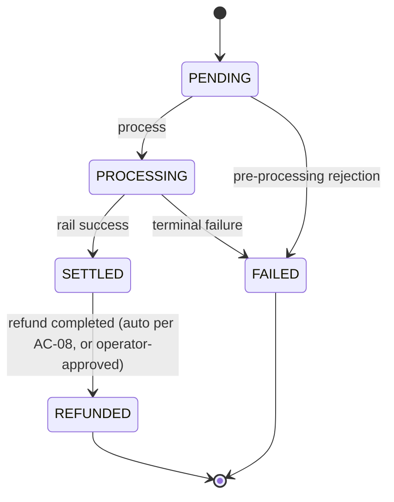
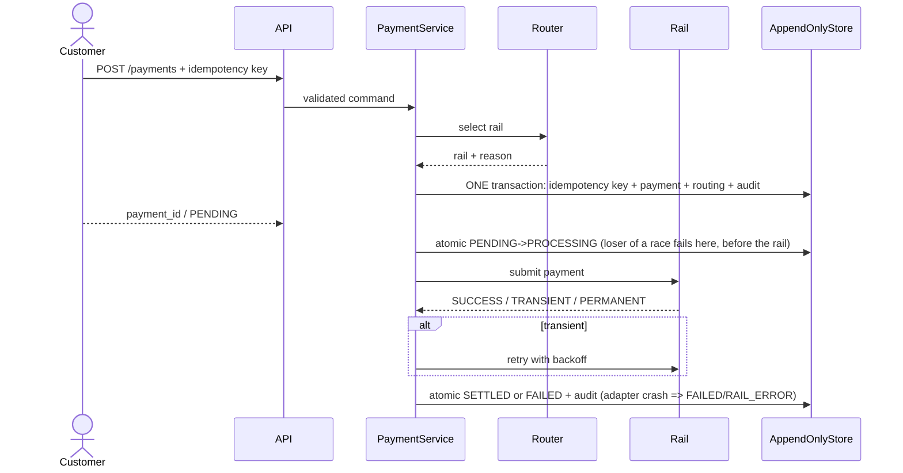

# PayBridge Architecture

## Layered structure

```text
controllers  ->  application  ->  domain
     |              |             |
     +--------------+-------> ports
                              |
                         infrastructure
                              |
                        SQLite / stub rails
```

## Payment lifecycle



## Routing and processing sequence



## Immutability strategy

The `payments` table stores creation facts only. All state changes are appended to `payment_transitions`. Repositories expose append methods and read projections. Audit events, routing decisions, settlement entries/files/imports, refunds, refund resolutions, reverse payments and reconciliation results are also append-only; SQLite triggers reject UPDATE/DELETE on all of them. Reconciliation history is kept and the latest result per settlement line is the projection. A trigger additionally enforces a legal, gap-free transition chain.

## Security boundaries

Authentication runs in controller dependencies and yields a unique subject plus role; the subject is the audit actor. Customer endpoints accept the customer role and are object-scoped (a payment owned by someone else is a 404). Rail execution, refund approval, settlement import/reconciliation/generation, queues and dashboard metrics require ops or admin. Domain errors are mapped in one place (`response_mapper.py`): 401/403/404/409/422. Sensitive data is masked before logging and persisted only in masked form where avoidable. Request correlation IDs are generated at the HTTP boundary and propagated through services.
