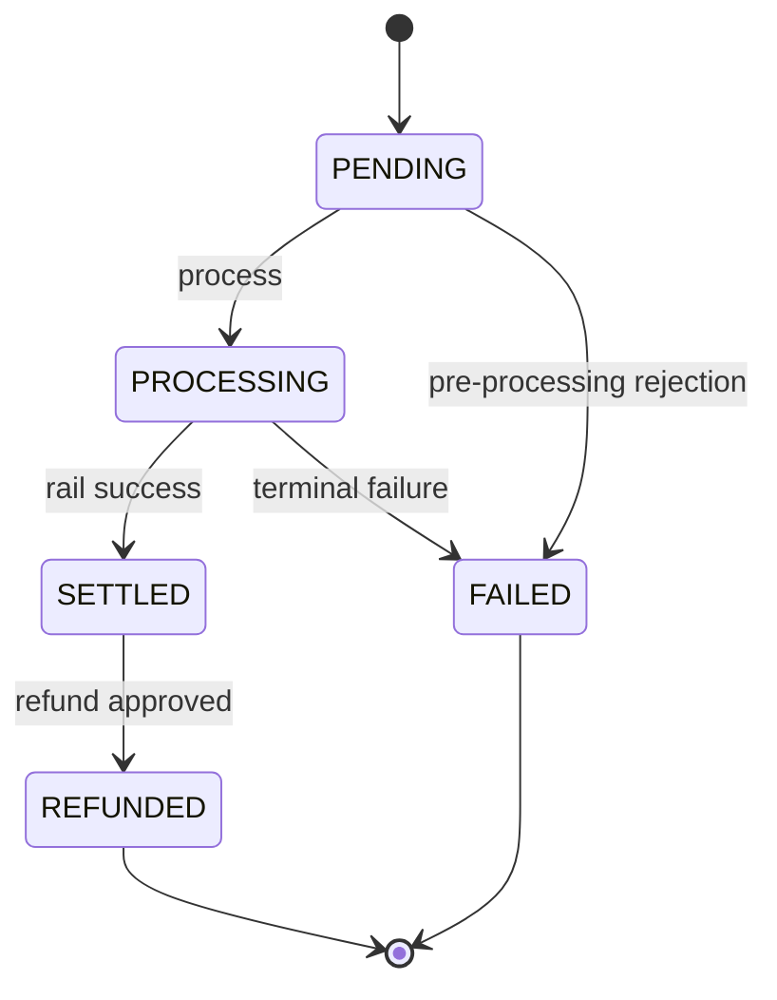
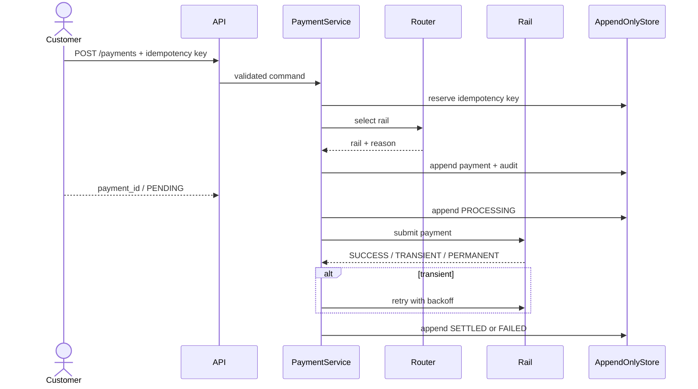

# PayBridge Architecture

## Layered structure

```text
controllers  ->  application  ->  domain
     |              |             |
     +--------------+-------> ports
                              |
                         infrastructure
                              |
                        SQLite / stub rails
```

## Payment lifecycle



## Routing and processing sequence



## Immutability strategy

The `payments` table stores creation facts only. All state changes are appended to `payment_transitions`. Repositories expose append methods and read projections. Settlement files and audit events are also append-only. SQLite triggers reject changes to immutable records after insertion.

## Security boundaries

Authentication runs in controller dependencies. Customer endpoints accept the customer role. Operational queues and dashboard metrics require ops or admin. Sensitive data is masked before logging and persisted only in masked form where avoidable. Request correlation IDs are generated at the HTTP boundary and propagated through services.
